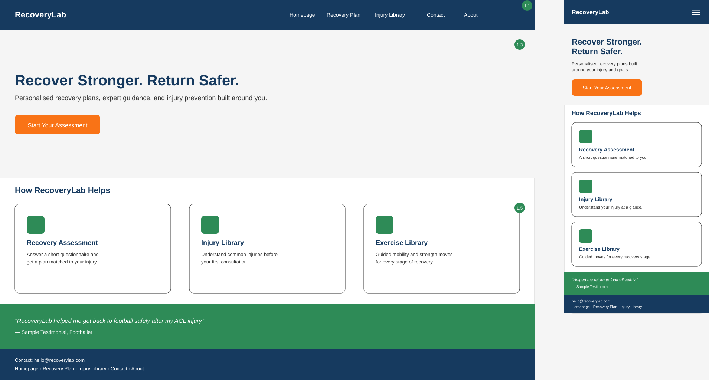
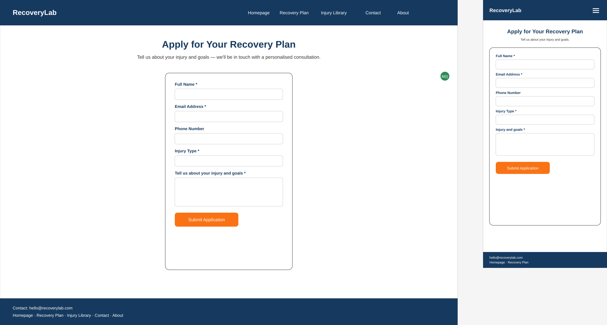
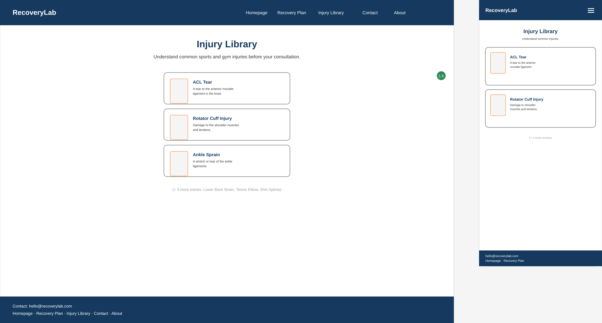
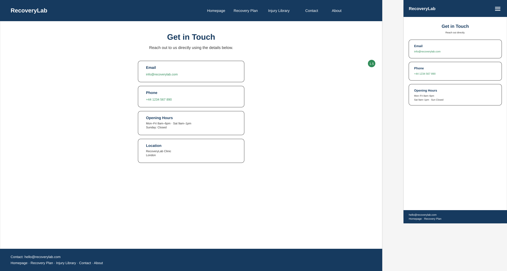
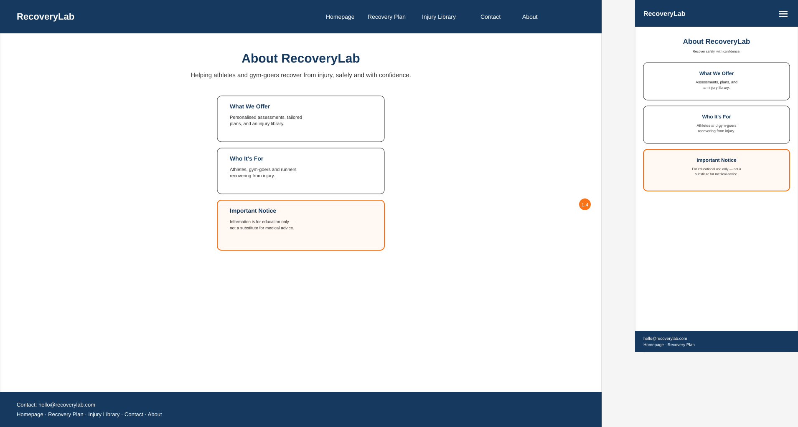

# RecoveryLab

## Purpose

RecoveryLab is a website that helps athletes and gym-goers safely recover from injuries. It provides personalised training programmes, rehabilitation advice, mobility routines and recovery plans tailored to individual needs, and educates users on injury prevention so they can return to training safely.

## Target Audience

18–45 year old athletes, gym-goers, runners, footballers, weightlifters, CrossFit athletes and anyone recovering from injury who wants to:

- Learn about common injuries
- Find a recovery programme suited to them
- Improve mobility and flexibility
- Build strength safely
- Understand when they are ready to return to sport
- Contact a coach for a personalised recovery plan

## Site Owner Goals

- Build trust within the fitness industry
- Generate new coaching clients
- Sell personalised rehabilitation programmes
- Encourage visitors to book consultations
- Grow an online community

## User Stories

**As an injured athlete, I want to apply for a recovery consultation through a short online form, so that I can get expert help without a lengthy or complicated sign-up process.**

*The finished Recovery Plan page, showing the short consultation application form that fulfils this user story.*

**As a gym-goer recovering from injury, I want to browse a library of common injuries, so that I understand my condition before applying for a consultation.**

*The finished Injury Library page, showing the body-diagram entries that fulfil this user story.*

## Site Owner Story

**As the site owner, I want visitors to find clear, trustworthy information before booking, so that they feel confident applying for a consultation.**

## Features

- Home page with hero section and call-to-action
- Recovery Plan
- Injury library
- Contact page
- About page

## Navigation

Home | Recovery Plan | Injury Library | Contact| About 

## Design System

### Colour Palette

| Colour | Hex |
|---|---|
| Dark Blue | `#163A5F` |
| Emerald Green | `#2E8B57` |
| Orange | `#F97316` |
| White | `#FFFFFF` |
| Dark Grey | `#333333` |

### Typography

- **Headings:** Poppins Bold
- **Body:** Open Sans

## UX Design Rationale

_This section will be expanded once wireframes and mockups are complete. It will cover:_

- Information hierarchy and how content is prioritised on each page
- User flow through the site (from landing to booking a consultation)
- Interaction feedback (hover states, form validation, confirmation messages)
- Accessibility decisions (contrast ratios, alt text, keyboard navigation)
- How the design allows users to initiate and control actions (e.g. no forced pop-ups or autoplay media)

Wireframes and mockups will be added to a `/design` directory and referenced here as they are produced.

### Homepage Wireframe

The homepage wireframe shows the main navigation (Homepage, Recovery Plan, Injury Library, Contact, About), a clear visual hierarchy from hero to feature cards to footer, and consistent card styling across the three feature highlights. The mobile layout collapses the navigation into a menu icon and restacks the feature cards vertically, preserving the same content order and priority as desktop.
?. ,BVCXZ`
'L;### Recovery Plan Wireframe

The Recovery Plan page was designed as a short, clearly labelled application form, with required fields marked and grouped logically (contact details, then injury details). This directly supports the M(i) criterion for clear, unambiguous interaction feedback, later implemented through inline validation messaging.

### Injury Library Wireframe

Each injury is presented as a consistent card pairing a diagram with a heading and description, supporting quick scanning and reinforcing the consistent graphics principle (1.5).

### Contact Wireframe

Contact information is broken into distinct, scannable cards (Email, Phone, Hours, Location) rather than a single dense paragraph, prioritising ease of access over form filling.

### About Wireframe

The About page separates general information from the medical disclaimer using distinct visual treatment, ensuring the disclaimer is never mistaken for decorative or secondary content (criterion 1.4).

## Accessibility

- Colour combinations checked against WCAG AA contrast requirements (4.5:1 minimum for body text)
- Alt text provided for all meaningful, content-bearing images (logo, feature icons, injury diagrams)
- Decorative background images (hero and testimonials sections) were implemented using CSS `background-image` rather than HTML `` tags. This is a deliberate accessibility choice: since these images are purely atmospheric and convey no information beyond visual mood, WCAG guidance recommends excluding decorative images from screen reader content entirely, rather than describing them. CSS backgrounds achieve this automatically, as they are not exposed to assistive technology
- Semantic HTML used throughout for screen reader compatibility

## Responsive Design

The site is designed mobile-first and tested across the following breakpoints:

- Mobile: up to 768px (single-column layout, collapsed hamburger navigation)
- Tablet/Desktop: 769px and above (multi-column layouts, full horizontal navigation)

The primary breakpoint (`max-width: 768px`) was chosen to comfortably cover common mobile and small-tablet screen widths, with the layout scaling fluidly above that point rather than relying on additional fixed breakpoints.

## Tech Stack

- **HTML5** — semantic markup throughout
- **CSS3** — custom, hand-written styles (no framework), using media queries for responsive design
- **JavaScript (vanilla)** — interactivity, form validation, questionnaire logic
- **Google Fonts** — Poppins (headings), Open Sans (body)

No CSS/JS frameworks are used for this unit, in order to directly demonstrate front-end fundamentals (semantic HTML, custom CSS, and vanilla JS) as required by the assessment criteria.

## Testing Procedure

Testing was carried out in two forms throughout this project: automated code validation using industry-standard tools, and manual testing of functionality, navigation, and responsiveness across devices and browsers.

### Code Validation

Validation was a continuous process throughout development, not left until the end — issues were noted and fixed at the point of discovery to prevent small problems compounding later. In the final stage of development, formal validation tools were used to systematically confirm the codebase met web standards.

### HTML Validation — [validator.w3.org](https://validator.w3.org)

Each page (Home, Recovery Plan, Injury Library, Contact, About) was validated individually via the deployed GitHub Pages URLs. All five pages returned:

> Document checking completed. No errors or warnings to show.

### CSS Validation — [jigsaw.w3.org/css-validator](https://jigsaw.w3.org/css-validator)

The site's single stylesheet (`assets/css/style.css`) was validated via its live URL and returned no errors or warnings.

### JavaScript Validation — [jshint.com](https://jshint.com)

The site's JavaScript (`assets/js/script.js`) was pasted into JSHint for linting. The first run returned 13 warnings, all related to ES6 syntax:
'const' is available in ES6 (use 'esversion: 6') or Mozilla JS extensions (use moz).
'let' is available in ES6 (use 'esversion: 6') or Mozilla JS extensions (use moz).
'arrow function syntax (=>)' is only available in ES6 (use 'esversion: 6').
'template literal syntax' is only available in ES6 (use 'esversion: 6').

These warnings were caused by JSHint's default configuration targeting ES5, an older JavaScript standard that predates `const`, `let`, arrow functions, and template literals. Adding `/* jshint esversion: 6 */` at the top of the file configured the linter to check against ES6 — the standard actually used in this project — which resolved all 13 warnings. This confirmed the JavaScript itself contained no genuine errors, the warnings were a linter configuration mismatch, not a code defect.

### Manual Testing

Testing was carried out continuously throughout development rather than only at the end, with issues identified and resolved as soon as they were discovered. Formal cross-browser and device testing was carried out once each page's core build was complete.

### Devices & Browsers Tested

| Device | Browser | Notes |
|---|---|---|
| MacBook Pro (desktop) | Safari | Primary development/testing browser |
| MacBook Pro (desktop) | Opera | Used to cross-check rendering consistency |
| iPhone (mobile) | Safari | Used to test responsive breakpoint and mobile navigation |

### Test Cases — User Story Validation

| What Was Tested | Action Performed | Expected Result | Actual Result | Pass/Fail |
|---|---|---|---|---|
| Recovery Plan form submission | Filled all required fields correctly and clicked Submit | Confirmation message displays, form resets | Confirmation message displayed, form reset as expected | ✅ Pass |
| Recovery Plan form validation | Submitted form with required fields left empty | Red error messages appear per field, submission blocked | Error messages appeared correctly, form did not submit | ✅ Pass |
| Recovery Plan email validation | Entered an invalid email format and submitted | "Please enter a valid email address" error shown | Error message displayed as expected | ✅ Pass |
| Injury Library content | Navigated to Injury Library and viewed all entries | All 6 entries display with heading, description, and diagram | All 6 entries displayed correctly | ✅ Pass |
| Desktop navigation | Clicked each nav link in the header | Each link navigates to the correct page | All links navigated correctly | ✅ Pass |
| Mobile navigation toggle | Resized to mobile width and clicked the hamburger icon | Menu opens and closes, `aria-expanded` updates | Menu toggled correctly, attribute updated as expected | ✅ Pass |
| Responsive layout | Resized browser window below 768px | Nav collapses to hamburger, feature cards stack vertically | Layout adapted correctly at the breakpoint | ✅ Pass |
| Form usability | Attempted to submit form without reading labels | User can understand each field's purpose from its label alone | Labels were clear; no ambiguity found | ✅ Pass |
| Injury Library readability | Read through injury descriptions on mobile | Text remains legible without excessive wrapping | Text displayed clearly after image/text layout fix | ✅ Pass |

### Bugs Found & Fixed

| Bug | Cause | Fix | Retested? |
|---|---|---|---|
| Stylesheet not loading; page rendered unstyled | Duplicated quotation marks on multiple HTML attributes, corrupting the `<link>` tag | Corrected all malformed attribute quotes | ✅ Retested in-browser — stylesheet loaded correctly, styling applied as expected |
| Mobile navigation menu overlapped the hamburger toggle | `.main-nav` remained a row-based flex container on mobile | Added `flex-wrap: wrap` and `flex-basis: 100%` | ✅ Retested on mobile view — menu dropped cleanly below toggle |
| Hamburger icon rendered below the nav menu | Missing `order` values on flex children | Set explicit `order` values on `.nav-toggle` and `.nav-menu` | ✅ Retested — hamburger consistently appears above menu |
| Hero background image not displaying | Invalid space in `linear-gradient()` function | Removed the space | ✅ Retested — background image rendered correctly |
| CSS syntax errors cascading across stylesheet | Missing semicolon after one property value | Added missing semicolon | ✅ Retested via VS Code Problems panel — all related errors cleared |
| JSHint reported 13 warnings on `script.js` | Linter defaulted to ES5, flagging valid ES6 syntax | Added `/* jshint esversion: 6 */` | ✅ Retested on jshint.com — all 13 warnings cleared |
| Injury Library images rendered oversized, squeezing text | HTML `class="injury-icon"` didn't match CSS `.injury-image` selector | Corrected class name and added `.injury-text` flex wrapper | ✅ Retested — images sized correctly at 56×78px, text no longer wrapping excessively |
| Logo appeared small despite height increases | Logo SVG had excess padding baked into its canvas/viewBox | Tightened the viewBox to reduce padding | ✅ Retested — logo visibly larger at the same CSS height |
| Hero text contrast insufficient against background photo | Light areas of photo reduced text legibility | Added text-shadow, increased overlay opacity, darkened image via `filter: brightness()` | ✅ Retested — text legible across all areas of the image |

**Known unresolved issues:** None currently identified. All bugs found during development and testing have been fixed and retested successfully.

All bugs listed above were identified through manual testing in-browser and resolved before final deployment. No known issues remain in the current build.

## Deployment

This site is deployed using **GitHub Pages**, directly from the `main` branch of this repository.

**Steps taken to deploy:**
1. Pushed the completed project to the `main` branch on GitHub
2. In the repository, navigated to **Settings > Pages**
3. Under **Source**, selected the `main` branch and the `/ (root)` folder
4. Saved, and GitHub Pages automatically built and published the site
5. The live site is available at: `https://s-azzouz.github.io/recovery-lab/`

Any future changes pushed to `main` are automatically redeployed by GitHub Pages within a few minutes.

## Attribution

- **Background images** (hero and testimonials sections) sourced from [Unsplash](https://unsplash.com), free to use under the Unsplash License.
- **Fonts**: Poppins and Open Sans, sourced from [Google Fonts](https://fonts.google.com), free to use under the Open Font License.
- **Icons and diagrams**: all icons, the site logo, and the injury body-diagrams are custom-made SVGs created specifically for this project.
- No other external code libraries or frameworks were used; all HTML, CSS, and JavaScript were hand-written.

## Development Process

This project followed an iterative development lifecycle, moving through planning, design, implementation, testing, and deployment — with earlier stages revisited as understanding of the project deepened.

**Planning and Requirements**
The project began with a milestone project plan defining the site's purpose, target audience, site owner goals, and potential features. User stories and a site owner story were written to capture what the finished site needed to achieve, and were later refined once the final feature set was confirmed, to ensure they accurately reflected what was built.

**Design**
A desktop and mobile wireframe was created for the homepage first, establishing the navigation structure, visual hierarchy, and card-based layout pattern that was then carried through to the remaining pages (Recovery Plan, Injury Library, Contact, About), each of which was also wireframed individually once the design system was established.

**Development / Implementation**
Each page was built HTML-first (semantic structure with no styling), followed by CSS in focused, single-purpose commits (e.g. header, hero, feature cards, forms), then JavaScript for interactivity such as the mobile navigation toggle and consultation form validation. The design system (colour palette, typography, spacing) was defined early using CSS custom properties, so later pages could reuse it consistently rather than duplicating values.

**Testing and Debugging**
Testing was carried out continuously throughout development, not only at the end. Real examples of this process include:
- A stylesheet failing to load site-wide was traced to malformed, duplicated quotation marks in HTML attributes, and fixed by correcting the markup across every page.
- A missing semicolon in a CSS declaration caused a cascade of unrelated-looking validator errors; this was diagnosed using VS Code's Problems panel rather than guesswork.
- An accessibility review of the Injury Library page (raised in tutor feedback) revealed a class name mismatch between the HTML and CSS, meaning images were never actually being sized — this was corrected, and a flex-based text wrapper was added to resolve the resulting narrow-text-wrapping issue.
- Feedback also identified insufficient colour contrast on the hero banner text against its background photograph. This was resolved using a combination of a text-shadow, a darkened background image via a CSS filter, and a stronger overlay — rather than a single fix, to ensure contrast held across all areas of the image.

Formal validation (W3C HTML Validator, Jigsaw CSS Validator, JSHint) and structured manual testing (functionality, usability, and responsiveness across devices and browsers) were carried out once the core build of each page was complete, with all bugs found during this process documented, fixed, and retested.

**Deployment**
The site was deployed early via GitHub Pages, directly from the `main` branch, so that functionality could be verified on the live, deployed environment throughout development rather than only at the end. Each subsequent push automatically redeployed the site, allowing issues to be caught and corrected on the real production version.

**Responding to Feedback**
Several changes were made in direct response to tutor feedback, including: correcting the Injury Library layout and class-name bug, increasing logo size and trimming excess padding from its source SVG, strengthening hero banner contrast through multiple combined techniques, adding finished-site screenshots paired with their corresponding user stories, and expanding this Development Process section itself.

This project is version-controlled using Git, with a separate, descriptively-messaged commit for each feature or fix — see commit history for a full chronological record of this process.
